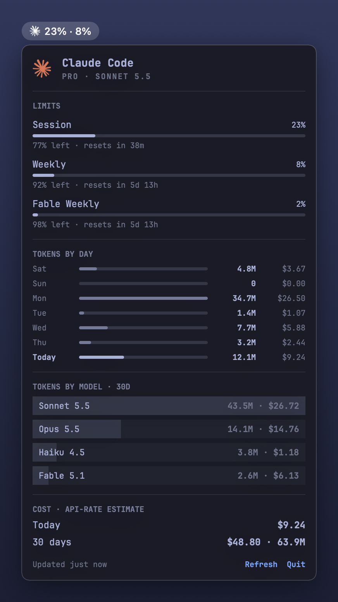

# Agent Usage

A macOS menu bar widget for Claude Code usage, ported from Omarchy's Agents bar widget. The menu bar shows your session and weekly limits used (`36% · 70%`, red from 90%); click it for the panel.

<p align="center"></p>

The panel shows:

- **Header:** your plan and the model your latest message used (`MAX 5X · OPUS 5.5`).
- **Limits:** session (5h), weekly, and any model-scoped weekly window, with percent used, percent left, and time to reset.
- **Tokens by day:** the last seven days of tokens, each with its API-rate cost.
- **Tokens by model:** the top four models over 30 days, with cost. Hover a row for the input / output / cache split.
- **Cost:** today and the last 30 days at Anthropic API rates (the same estimate CodexBar shows). A subscription is not billed this way; the number answers "what would this have cost on the API".

## Install

Requires macOS 14+ and the Xcode Command Line Tools (`xcode-select --install`). You must be signed in to Claude Code with a subscription.

```bash
git clone https://github.com/voidnologo/agent-usage-mac.git
cd agent-usage-mac
./scripts/install.sh
```

The script builds a release binary, installs `~/Applications/Agent Usage.app`, and registers a LaunchAgent so it starts at login. Run it again to update. `./scripts/uninstall.sh` removes both.

## Where the numbers come from

| Data | Source | Refresh |
|---|---|---|
| Limits | `GET https://api.anthropic.com/api/oauth/usage` with Claude Code's OAuth token | every 5 minutes, and when the panel opens (at most every 15s) |
| Plan | `subscriptionType` / `rateLimitTier` in Claude Code's credentials | with the limits |
| Tokens, models, cost | `~/.claude/projects/**/*.jsonl` (or `$CLAUDE_CONFIG_DIR/projects`) | every minute; only bytes appended since the last read are parsed |

The token is read from the Keychain item `Claude Code-credentials` through `/usr/bin/security`, which Claude Code already trusts, so there is no Keychain prompt; `~/.claude/.credentials.json` is the fallback. The widget never refreshes the token: a refresh rotates the refresh token and would sign Claude Code out. When the token expires the panel says so and keeps the last limits until Claude Code refreshes it.

Token totals count input, output, cache read and cache write, deduplicated by message id and request id, bucketed by local calendar day. Prices live in `Sources/AgentUsageCore/Pricing.swift`; a model missing from that table is shown as unpriced rather than guessed, and the panel says how many tokens that excludes.

## Development

```bash
swift build                          # debug build
swift run AgentUsageChecks           # behaviour checks
swift run AgentUsageChecks --live    # checks, then your real limits and a full transcript scan
swift run AgentUsage --render-readme-screenshot docs/screenshot.png   # README image, from invented sample data
```

The checks are an executable rather than an XCTest target because XCTest and Swift Testing need a full Xcode install, and this builds with Command Line Tools alone.

| Path | Holds |
|---|---|
| `Sources/AgentUsageCore/` | Credentials, the limits client, the transcript scanner, pricing, formatting. No UI. |
| `Sources/AgentUsage/` | The SwiftUI menu bar app: the refresh schedule (`UsageStore`), the label, the panel, the theme. |
| `Sources/AgentUsageChecks/` | The check runner. |
| `scripts/` | Install and uninstall. |

## Credits

Panel layout, palette (tokyo-night), formatting rules, and the Claude mark are adapted from [Omarchy](https://github.com/basecamp/omarchy)'s `shell/plugins/agents` (MIT). The cost method follows [CodexBar](https://github.com/steipete/CodexBar)'s API-rate estimate (MIT).
